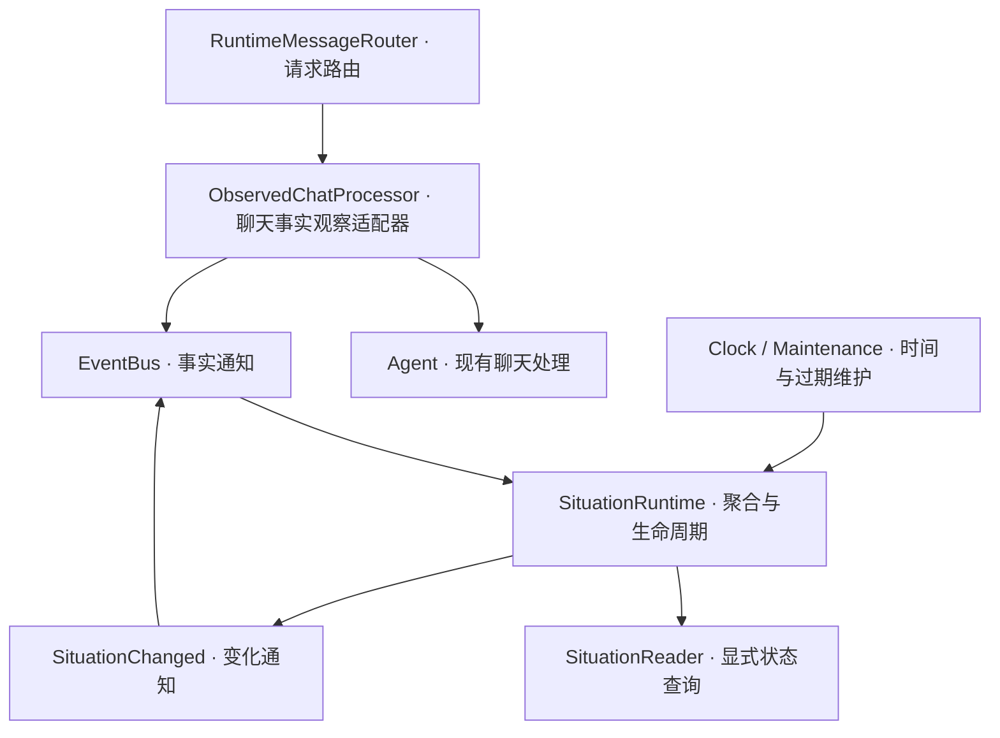

# Phase 5 — Situation Engine Design

Date: 2026-09-27 (Asia/Shanghai)

Status: Accepted design baseline; no Situation implementation exists yet.

Baseline: `75a7e5c3f1aad119189be6b18265dcea46966b2b`.

## 1. 已确认范围与工程目标

Owner 已在 2026-09-27 对话中接受：

1. 首版采用确定性规则，暂不加入 LLM 情境解释。
2. 优先完成内部情境链路与可检查验收，暂不接入聊天 Prompt。
3. 正式开发流程优先，理解说明为辅助；理解问答不是推进门槛。

本文的场景、字段、阈值及运行时策略是 Assistant 提出的工程方案。
以下工程细节已在本 Task 中完成设计审查；其实现与运行验收仍属后续 Task。

目标：把有来源的近期运行时事实转换为有证据、会失效、可查询的情境，
为后续 Attention 提供稳定输入。

首版完成后可以解释“为什么出现这个情境”和“为什么它已经不再有效”。
普通聊天和 Memory 治理不依赖 Situation 成功。

## 2. 所属层与数据流

本图为拟议增量。适配器只观察请求与结果，保留原 Agent 返回值与异常行为。
Memory 路由仍直接进入原 MemoryProtocolHandler。

Situation 只订阅明确的输入事实类型，不订阅自身输出，不形成事件反馈环。

## 3. 首批情境目录

### 3.1 RECENT_CHAT_INTERACTION — 近期发生聊天交互

- 输入：运行时接受处理的、内容为非空字符串的 chat 请求事实。
- 含义：最近 120 秒内，本 Core 收到过符合上述形状的聊天请求。
- 不表示：用户持续注视屏幕、用户空闲、可以打扰、请求已经成功。
- 首条有效事实建立情境；较新的事实刷新证据与有效期。
- 到期且没有新证据时过期；没有事实时不输出该情境。

这是有意保守的当前上下文，不能命名为“用户正在专注聊天”。

### 3.2 REPEATED_PROVIDER_FAILURE — 近期重复出现 Provider 临时失败

- 输入：当前单一 Provider 配置下的聊天请求结果事实。
- 计数范围：最近 120 秒内、最近一次成功结果之后，至少 3 次不同调用的
  `PROVIDER_TIMEOUT`、`PROVIDER_UNAVAILABLE` 或 `PROVIDER_RATE_LIMITED`。
- 身份验证、配置错误、配额错误、无效请求及未知错误不混入本条规则。
- 含义：当前聊天路径近期多次报告可归入该规则的 Provider 失败。
- 不表示：已经诊断网络断开、用户反复执行同一操作、用户感到沮丧。
- 一次时间较新的成功结果结束该情境；证据跌破时间窗口内的阈值则过期。
- 不触发重试、切换 Provider、提醒或资源准入。

同一时间戳同时有成功和失败时，首版采用保守规则：该时间点及之前的失败
不计入成功之后的新失败序列；保留规则原因，避免凭到达顺序伪造先后关系。

### 3.3 场景选择的理由

两条规则复用当前真实运行时：一条证明近期状态，一条证明多事件聚合及解除。
它们使 Phase 5 能做生产装配验收，同时不提前实现 Phase 7 的桌面采集。

Unity 活跃、项目源文件修改、编译失败与重试组成的调试情境继续作为后续扩展目标。
本阶段不定义空壳 Unity Adapter，也不把合成事件演示称为桌面感知验收。

## 4. 输入事实与来源

沿用 frozen RuntimeEvent 及其 UUID、UTC occurred_at、source、correlation_id、causation_id。
新增类型名称为设计建议，最终实现应保持本文语义。

| 输入类型 | 产生位置 | 最小业务字段 |
| --- | --- | --- |
| ChatRequestObserved | 聊天观察适配器调用 Agent 前 | Core 生成的 invocation_id |
| ChatProviderOutcomeObserved | Agent 返回已识别的响应后 | invocation_id；SUCCESS 或已知安全错误类别 |

一次实际调用生成新的 invocation_id；两个事实使用同一 UUID 关联。
不把客户端 Message.id 转成 UUID：现有 Message.id 的契约是字符串，
且任意客户端内容不应成为 Situation 的日志字段。
重复投递同一个事实保留同一个 event_id 和 invocation_id。

输入不得包含用户正文、模型正文、Prompt、API key、原始异常、文件路径或窗口标题。
source 为适配器固定值，不从用户消息 source 复制。

观察适配器仅对 type=chat 且 payload.message 为非空字符串的请求生成请求事实。
其他输入仍交给原 processor，不能借本 Task 改变现有校验或返回行为。

返回 type=response 时生成 SUCCESS；已知 Provider 协议错误映射成封闭枚举。
未知 error 不猜测为 Provider 失败。未处理异常与 cancellation 原样传播，
不捏造 Provider 结果；已产生的近期交互情境自行过期。

## 5. 输出与证据语义

SituationSnapshot 为不可变领域对象，至少包括：

- situation_id：本次情境实例的 UUID。
- kind：上述封闭目录之一。
- subject_key：首版仅支持当前 Core 的聊天上下文或当前单一 Provider 上下文。
- revision：同一实例中单调增加的版本号。
- first_detected_at / last_updated_at：引擎产生判断的时间。
- valid_until：在没有新事实时，当前证据仍足以支持该情境的截止时间。
- evidence：有界证据引用，含 event_id、invocation_id、来源、发生时间和事实类别。
- reason_code：稳定规则原因；使用规则解释，无未经校准的概率数字。
- lifecycle：ACTIVE / ENDED / EXPIRED。
- rule_id / rule_version：便于复现判断来源。

本阶段不生成面向用户的自由文本解释；检查入口可依据字段显示受控摘要。

事件只表示“引擎在此时产生／更新／结束了判断”。情境内容仍具有规则推断语义，
不会因通过 EventBus 发布就成为永久确定事实。

派生变化通知使用新的 event_id；单一输入触发时 causation_id 指向该输入。
多条支持证据全部记录在 evidence，不能用一个 causation_id 代替证据集合。
过期维护触发时不伪造外部因果事件；correlation_id 可以为空。

## 6. 生命周期、身份与时间

一个 Core 内按 (kind, subject_key) 聚合，允许不同 kind 同时有效。
同一有效情境的实质变化更新同一 situation_id 并递增 revision。
结束或过期后再次满足条件，生成新 situation_id。
查询本身不产生版本或变化事件；同一输入重投不产生新版本。

有效窗口采用 `evaluation_time - window < occurred_at <= evaluation_time`。
边界相等于截止时间时已经过期。接收时刻和事实发生时刻不得混用。

RECENT_CHAT_INTERACTION 的 valid_until 为最新有效请求事实发生时间 + 120 秒。
REPEATED_PROVIDER_FAILURE 的 valid_until 为“维持至少 3 条失败所需的第三新失败”
发生时间 + 120 秒；不能简单使用最新失败 + 120 秒，否则可能在证据只剩一条时
继续声称“重复失败”。更多或更旧的证据进入／退出窗口均应重新计算。

乱序策略：只接纳仍在窗口内的事实，按发生时间重新评估。
已知成功时间作为该 Provider 的下界；晚到的旧失败不能复活已被成功解除的情境。
到达顺序仅用于运行时处理，不作为世界事实发生顺序的证明。

Clock 继续作为时间来源并规范化为 UTC，测试使用可控 Clock。
未来时间戳不参与本轮有效判断，记录安全的拒绝原因。
引擎保留不回退的 evaluation watermark；系统时钟回退时标记评估时间降级，
拒绝产生“新鲜”的新判断，直到时钟追上。查询不能复活已经过期的状态。
时钟前跳按新的时间过期；不得通过恢复旧时间重新激活。

进程重启清空情境与证据；本阶段不持久化、不重放、不写入 Memory。

## 7. 有界状态与退化

初始工程默认值（可通过构造参数在测试中覆盖，暂不增加用户设置）：

| 项目 | 初始值 |
| --- | --- |
| 两条规则的时间窗口 | 120 秒 |
| 重复 Provider 失败阈值 | 3 次不同调用 |
| 维护检查间隔 | 1 秒 |
| 输入事实／去重状态总上限 | 1024 条，相关结构均受同一策略约束 |
| 单快照证据引用上限 | 8 条 |
| 活动情境数 | 固定首版 kind / subject 组合最多 2 个 |

过期事实和去重记录一起回收；超过时间窗口的重投仍按过期输入拒绝。
按 invocation_id 与结果类别避免重复结果事实把一次调用计为多次失败。
同一 invocation 出现冲突结果属于输入异常，不按两次调用统计。

有效证据容量耗尽时不能随意截断后仍声称结果完整。
首版保守处理：将受影响评估标记 DEGRADED，撤回该聚合状态的当前有效性，
清理受影响的有界缓冲后从新证据重建；变化使用明确的 evidence_capacity 原因。
输出证据引用的截断与聚合所需的内部证据容量必须区分。

查询结果除了活动情境，还返回 evaluated_at 和 capability health。
空列表只表示“当前没有可返回的有效情境”；健康状态用于区别正常未匹配与评估失败。
健康状态不承诺所有世界事件都已被观察到，也不代表 EventBus 有可靠投递。

## 8. 状态所有权、查询与通知

SituationRuntime 独占可变聚合状态；外部只能接收不可变快照。
核心规则尽量保持无 IO，可在固定输入与时间下确定性求值。

SituationReader 提供显式 async 查询，不依赖 EventBus 返回值。
查询按当前有效时间过滤快照，即使维护循环稍晚调度，也不能返回已过期快照。
语义更新和到期清理由引擎负责，查询不承担发布通知的副作用。

输入处理、维护及查询通过同一个串行化边界取得一致视图。
状态修改和对应变化的通知入队尝试保持版本顺序；禁止在该边界执行网络、数据库、
LLM 调用或等待 EventBus 下游完成。

SituationChanged 携带该次不可变快照及其版本，不要求消费者查询“最新状态”来
反推旧事件含义。首版消费者只做检查／验收，不执行主动行为。

通知为瞬时、尽力投递。当前内存状态是情境查询的权威来源。
通知入队失败不回滚已经有效的状态；必须记录安全失败类别和 notification health。
不创建自动重试队列、durable outbox 或隐式无限缓冲。
未来消费者如果需要恢复一致性，必须通过显式快照查询建立自己的恢复契约。

## 9. 失败矩阵

| 情形 | 本阶段行为 |
| --- | --- |
| 没有足够证据 | 正常无情境 |
| 重复、过期事实 | 不重复计数；按确定规则忽略 |
| 无效／未来事实 | 拒绝其参与判断，记录安全原因 |
| 可恢复规则评估失败 | 受影响状态不再作为有效结果输出；标记降级 |
| 输入通知未入队 | 生产者记录观察投递失败，原聊天响应不因此失败；Situation 只依据已收到事实判断 |
| 输出通知队列满 | 保留状态，记录 EventBusFullError 对应的通知失败，不等待容量 |
| 关闭期间输出被拒绝 | 记录未投递原因，继续已接受输入的处理；不声称派生事件已送达 |
| 查询失败 | 显式返回安全的不可用结果或 capability error；不伪装成健康空列表 |
| cancellation | 保持传播与任务清理，不当普通失败吞掉 |

输入丢失会导致暂时不完整的情境，这是当前瞬时 EventBus 的实际限制。
本阶段不保证 exactly-once、at-least-once 或所有实际事件都可见。
Producer 的投递健康和 Situation 的评估／通知健康分别可检查，不能用一个健康布尔值掩盖差异。

初始构造／非法策略失败应在启动阶段明确暴露，不能启动半装配模块。
新增清理逻辑不得妨碍已有 EventBus / Provider 的 finally 清理。

## 10. 启动与关闭

composition root 负责以下顺序：

1. 创建 Clock、规则、SituationRuntime 与只读接口。
2. 在 EventBus.start() 前注册两个明确输入类型的订阅者。
3. 用 ObservedChatProcessor 装饰现有 Agent，注入 RuntimeMessageRouter.chat_processor。
4. 启动 EventBus，启动有界的过期维护任务，再运行原服务器。
5. 关闭时停止事实生产入口和维护任务，等待维护任务退出。
6. 调用原 EventBus.close() 排空已接受输入；此时派生通知可能被拒绝，按第 9 节处理。
7. 清理 Situation 内存资源并保留已有 Provider 关闭保证。

EventBus 排空只保证其原有 accepted-work 语义，不保证整个派生事件图都执行完成。
本阶段不改写 ADR 0011 / 0012；如后续业务需要派生链完全排空，单独设计并修订 ADR。

维护任务直接调用明确的过期能力，不构造伪装成世界事实的“请清理”Event。
不为此引入通用 Scheduler。循环错误可观测、取消可回收，不留下 orphan task。

## 11. Memory、Prompt 与其他模块

首批两个场景不需要 Memory 查询。暂不添加 SituationMemoryContext 空接口。
未来若规则确需历史背景，先设计携带事实来源、时间、scope 和 revision 的只读输入。
当前 PreparedMemoryContext 的字符串集合不能直接替代这种可追溯证据。

首版不向 PromptContextComposer 注入 Situation，不调整自动学习管线。
后续接入聊天时必须额外审查：推断标识、过期信息、删除传播及推断被学习为事实的风险。

Attention 拥有关注与打扰策略；Behavior 拥有行为提议；ADR 0019 的未来 Admission
拥有运行条件决策；Permission 保持独立。情境的证据窗口与事实去重属于 Situation，
提醒 cooldown 与“同一句话不要再说”属于 Attention。

## 12. 可观测性与验收

安全日志允许：模块常量、UUID、kind、revision、rule_id、受控 reason / outcome、计数与耗时。
禁止记录完整事件 repr、任意异常文本和用户内容。不会把所有输入事实永久写成审计历史。

真实最小链路：WPF chat → Router → 观察适配器 → EventBus → Situation → 安全变化日志。
显式查询通过同进程集成验收直接调用 SituationReader 验证；生产装配测试须证明
订阅者和查询接口引用同一个 SituationRuntime。首版不新增 WebSocket 情境查询协议或 WPF UI。
重复失败链路通过 deterministic FakeProvider / FakeProcessor 或受控故障适配器验证，
不为了验收消耗真实配额或故意破坏真实凭据。

自动验收至少覆盖：

- 单次近期交互建立、刷新、精确到期；空白或非 chat 输入不被误观察。
- 2 次临时失败不建立，3 次建立；同一次调用重投不增加计数。
- 最新成功解除，晚到旧失败不复活；时间戳相同采用约定的保守规则。
- 第三新失败到期使阈值不再成立；不是仅在最后一次失败到期才清理。
- 窗口边界、未来时间、时钟回退、容量耗尽、重启清空。
- 真实 EventBus exact-type 订阅、状态查询、输出版本、无反馈循环。
- 队列满、关闭期间派生发布、维护任务取消与 Provider 清理回归。
- 观察或识别退化不改变原响应／错误映射／Memory 治理。
- 日志中无输入正文、模型正文、API key 或任意原始异常。

完整 pytest / Ruff / mypy 在集成及阶段收尾门执行；Desktop build 在最终垂直链路验收执行。
纯文档 Task 1 不重跑运行时套件，也不声称产生了新的测试通过记录。

## 13. 本 Task 最需要理解的三个点

1. 先定义含义和失败后果，再决定类和函数。
2. 事实来源、情境判断、通知投递是三个不同的责任与成功条件。
3. 成熟流程允许小范围首版，但每条能力必须有真实路径和反例验收。

对应 ADR：0022 / 0023（Accepted）。
下一步：完成 Task 1 的 Git 检查点，随后按 Task Plan 进入契约实现。
